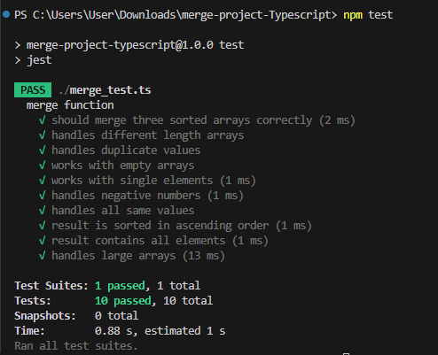

# merge-project-Typescript
For Primo pre-test as a Full-stack developer (intern)
# How to Run Unit Tests in TypeScript - Step by Step

---

## ขั้นตอนที่ 1: ติดตั้ง Node.js

1. ไปที่ https://nodejs.org/
2. ดาวน์โหลดเวอร์ชัน LTS (แนะนำ)
3. ติดตั้งตามปกติ (Next > Next > Install)
4. เปิด Command Prompt หรือ PowerShell
5. เช็คว่าติดตั้งสำเร็จ:

```bash
node --version
npm --version
```

ถ้าขึ้นเลขเวอร์ชัน แสดงว่าติดตั้งสำเร็จ ✅

---

## ขั้นตอนที่ 2: เตรียมไฟล์โปรเจค

1. สร้างโฟลเดอร์ใหม่ เช่น `merge-project-Typescript`
2. ใส่ไฟล์เหล่านี้ลงไป:
   - `package.json`
   - `tsconfig.json`
   - `jest.config.js`
   - `merge.ts` (ไฟล์โค้ดหลัก)
   - `merge_test.ts` (ไฟล์ test)

---

## ขั้นตอนที่ 3: เปิด Terminal ในโฟลเดอร์

### ใช้ Terminal ของ VS Code:
1. เปิด VS Code
2. File > Open Folder > เลือกโฟลเดอร์ของคุณ
3. Terminal > New Terminal

---

## ขั้นตอนที่ 4: ติดตั้ง Packages

รันคำสั่งนี้ทีละคำสั่ง:

```bash
npm install
```

ถ้าเจอ error ให้รัน:

```bash
npm install --save-dev @types/jest jest ts-jest typescript
```

รอจนขึ้น "added XXX packages" แสดงว่าสำเร็จ ✅

---

## ขั้นตอนที่ 5: รัน Tests

### วิธีที่ 1: ใช้ npm script
```bash
npm test
```

### วิธีที่ 2: ใช้ npx (ถ้าวิธีที่ 1 ไม่ได้)
```bash
npx jest
```

### วิธีที่ 3: ระบุไฟล์เฉพาะ
```bash
npx jest merge_test.ts
```

---

## ผลลัพธ์ที่ควรเห็น

```
 PASS  ./merge_test.ts
  merge function
    ✓ should merge three sorted arrays correctly (3 ms)
    ✓ handles different length arrays (1 ms)
    ✓ handles duplicate values
    ✓ works with empty arrays
    ✓ works with single elements
    ✓ handles negative numbers
    ✓ handles all same values
    ✓ result is sorted in ascending order (1 ms)
    ✓ result contains all elements (1 ms)
    ✓ handles large arrays (14 ms)

Test Suites: 1 passed, 1 total
Tests:       10 passed, 10 total
```

ถ้าเห็นแบบนี้ แสดงว่า **สำเร็จแล้ว!** 🎉

---

## คำสั่งที่ใช้บ่อย

### รัน test ทั้งหมด
```bash
npm test
```

### รัน test แบบ watch mode (รันอัตโนมัติเมื่อแก้ไขไฟล์)
```bash
npx jest --watch
```

### ดู test coverage (ดูว่า code ถูก test ไปกี่ %)
```bash
npx jest --coverage
```

### รัน test ไฟล์เดียว
```bash
npx jest merge_test.ts
```

---

## แก้ปัญหาที่พบบ่อย

### ❌ 'jest' is not recognized
**แก้:** ใช้ `npx jest` แทน `jest`

### ❌ Preset ts-jest not found
**แก้:** รัน `npm install --save-dev ts-jest`

### ❌ Cannot find module
**แก้:** 
1. ลบโฟลเดอร์ `node_modules`
2. รัน `npm install` ใหม่

### ❌ JSON.parse Failed
**แก้:** ตรวจสอบไฟล์ `package.json` ว่ามี syntax ถูกต้องไหม (ไม่มีเครื่องหมาย , หรือ } เกิน)

---

## โครงสร้างไฟล์ที่ถูกต้อง

```
merge-project-Typescript/
├── node_modules/          (สร้างขึ้นเองหลัง npm install)
├── package.json           (ต้องมี)
├── tsconfig.json          (ต้องมี)
├── jest.config.js         (ต้องมี)
├── merge.ts               (ไฟล์โค้ดหลัก)
└── merge_test.ts          (ไฟล์ test)
```

---

## สรุปคำสั่งทั้งหมดตามลำดับ

```bash
# 1. เช็คว่ามี Node.js
node --version

# 2. เข้าไปในโฟลเดอร์
cd merge-project-Typescript

# 3. ติดตั้ง packages
npm install

# 4. รัน tests
npm test

# หรือ
npx jest
```

---

## Unit test Completed! 🎉
## Outcome from My Unit test by Typescript
 

ถ้าทำตามนี้แล้วเห็น "10 passed" แสดงว่าทุกอย่างพร้อมแล้ว
ถ้าติดปัญหาตรงไหน ลองดูที่ส่วน "แก้ปัญหาที่พบบ่อย" ด้านบนครับ
Author by Nattawat Ruensumrit 
Email : nattawat140947@gmail.com